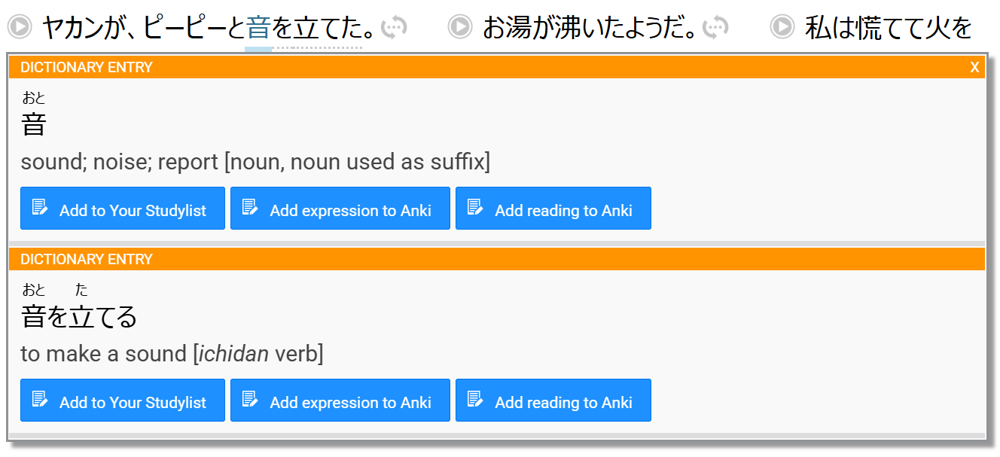

# Satori Reader Anki Extension

## About

A chrome extension to allow adding vocab to Anki from Satori Reader.

## Installation

* Install [AnkiConnect](https://ankiweb.net/shared/info/2055492159)
* [Download extension](https://github.com/spacehamster/SatoriReaderAnkiExtension/releases) and unzip
* Open chrome extensions page
* Select Load unpacked and select the unzipped extension folder
